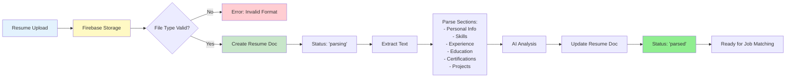
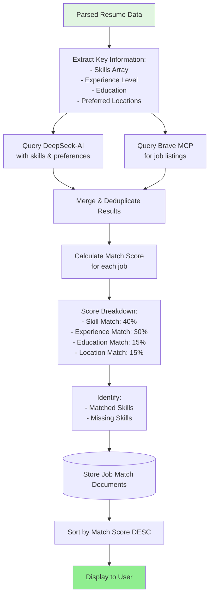
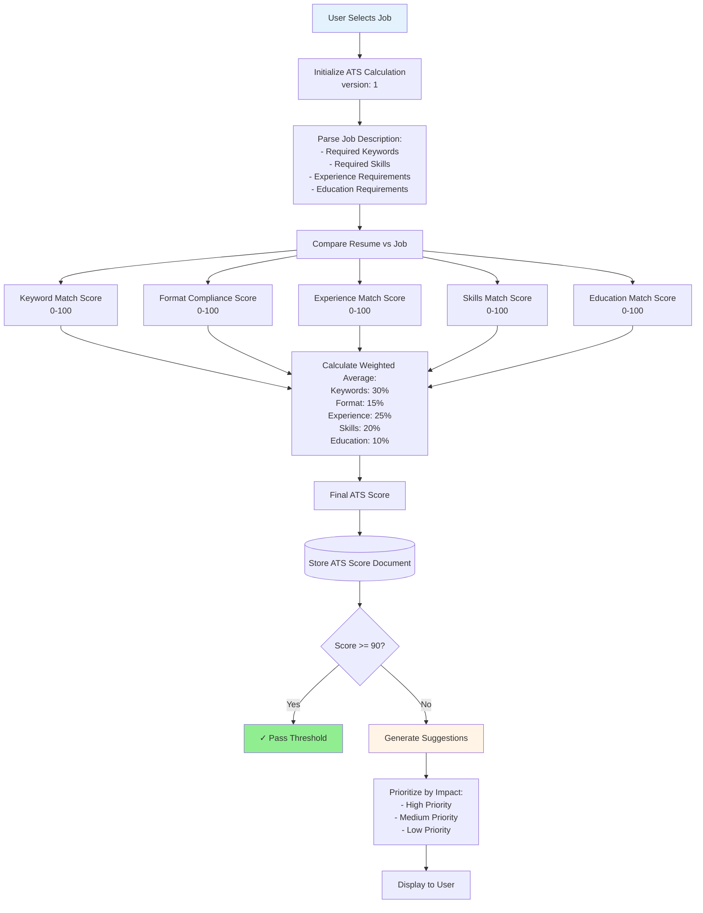
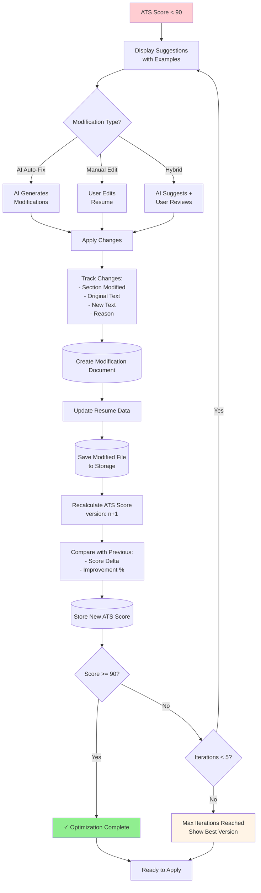
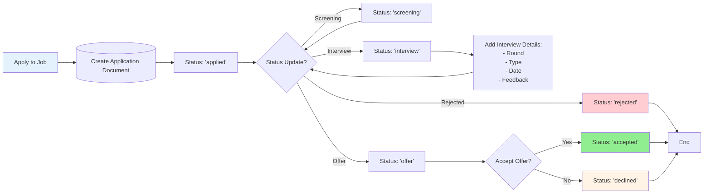
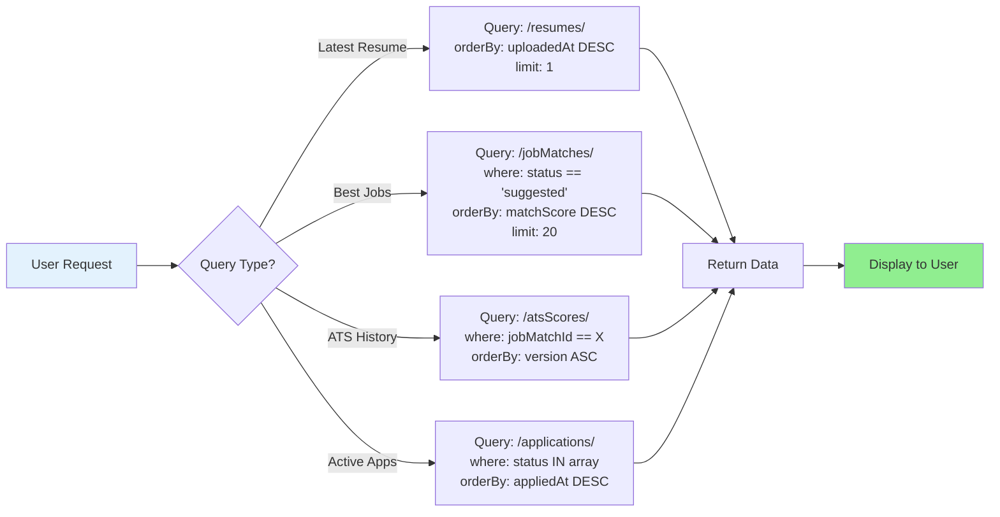
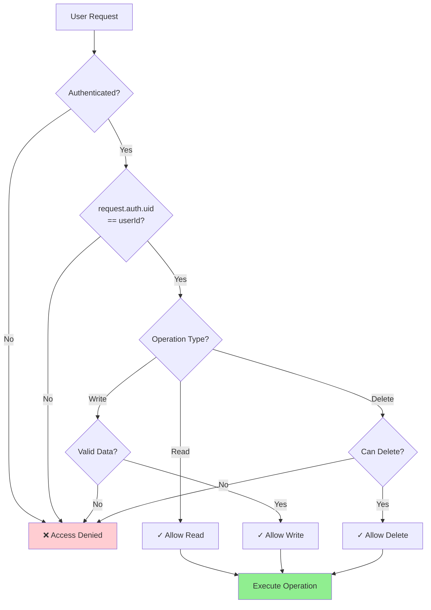
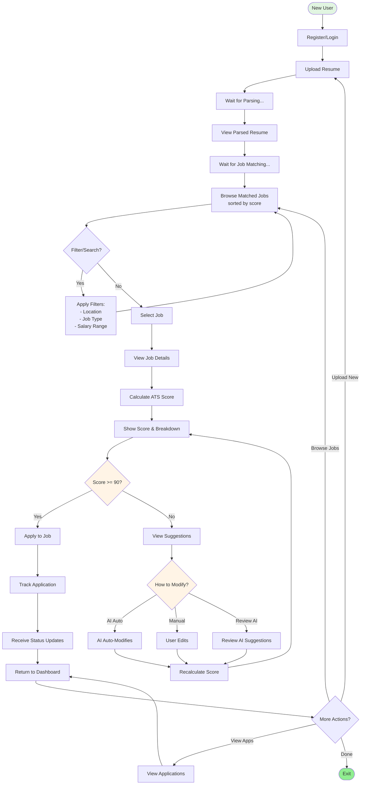

# Skill Hunter - System Flowchart

## Main Application Flow

```mermaid
flowchart TD
    Start([User Opens App]) --> Auth{Authenticated?}
    Auth -->|No| Login[Login/Register]
    Login --> CreateUser[(Create User Document)]
    CreateUser --> Dashboard
    Auth -->|Yes| Dashboard[Dashboard]
    
    Dashboard --> Upload[Upload Resume]
    Upload --> StoreFile[(Store in Firebase Storage)]
    StoreFile --> CreateResume[(Create Resume Document<br/>status: 'parsing')]
    CreateResume --> ParseResume[AI Resume Parser]
    
    ParseResume --> UpdateResume[(Update Resume Document<br/>with parsedData<br/>status: 'parsed')]
    UpdateResume --> AIAnalysis[AI Analysis:<br/>- Strength Areas<br/>- Improvement Areas<br/>- Suggested Roles]
    
    AIAnalysis --> FetchJobs[Fetch Jobs from<br/>DeepSeek-AI & Brave MCP]
    FetchJobs --> CreateMatches[(Create Job Match Documents<br/>with matchScore)]
    CreateMatches --> SortJobs[Sort by Match Score]
    SortJobs --> DisplayJobs[Display Top Job Matches]
    
    DisplayJobs --> UserSelect{User Selects Job?}
    UserSelect -->|No| Dashboard
    UserSelect -->|Yes| CalcATS[Calculate Initial ATS Score<br/>version: 1]
    
    CalcATS --> StoreATS[(Store ATS Score Document<br/>with breakdown & suggestions)]
    StoreATS --> CheckScore{ATS Score >= 90?}
    
    CheckScore -->|Yes| PassThreshold[✓ Resume Optimized]
    PassThreshold --> AskApply{Apply Now?}
    
    CheckScore -->|No| ShowSuggestions[Display Improvement<br/>Suggestions]
    ShowSuggestions --> ModifyResume[Modify Resume:<br/>- Rephrase content<br/>- Add keywords<br/>- Adjust format]
    
    ModifyResume --> CreateMod[(Create Modification Document<br/>with changes)]
    CreateMod --> SaveModified[(Save Modified Resume<br/>to Storage)]
    SaveModified --> RecalcATS[Recalculate ATS Score<br/>version: n+1]
    
    RecalcATS --> StoreNewATS[(Store New ATS Score<br/>with improvement delta)]
    StoreNewATS --> CheckScore
    
    AskApply -->|Yes| CreateApp[(Create Application Document<br/>status: 'applied')]
    CreateApp --> TrackApp[Track Application Status]
    TrackApp --> Dashboard
    
    AskApply -->|No| Dashboard
    
    style Start fill:#e1f5e1
    style PassThreshold fill:#90ee90
    style CheckScore fill:#fff4e6
    style UserSelect fill:#fff4e6
    style AskApply fill:#fff4e6
    style Auth fill:#fff4e6
```



---

## Detailed Resume Processing Flow



---

## Job Matching Algorithm Flow



---

## ATS Score Calculation Flow



---

## Resume Modification & Iteration Flow



---

## Application Tracking Flow



---

## Database Write Operations Flow

```mermaid
flowchart TD
    Start[User Action] --> Type{Operation Type?}
    
    Type -->|Upload| Upload[Resume Upload]
    Type -->|Match| Match[Job Matching]
    Type -->|Score| Score[ATS Calculation]
    Type -->|Modify| Modify[Resume Modification]
    Type -->|Apply| Apply[Job Application]
    
    Upload --> W1[(Write: /users/{uid}/resumes/)]
    Match --> W2[(Write: /users/{uid}/jobMatches/)]
    Score --> W3[(Write: /users/{uid}/atsScores/)]
    Modify --> W4[(Write: /users/{uid}/resumeModifications/)]
    Apply --> W5[(Write: /users/{uid}/applications/)]
    
    W1 --> Update1[(Update: User metadata)]
    W2 --> Index1[Create Index:<br/>matchScore DESC]
    W3 --> Index2[Create Index:<br/>version ASC]
    W4 --> Link1[Link to:<br/>- resumeId<br/>- jobMatchId<br/>- atsScoreId]
    W5 --> Update2[(Update: Job Match status)]
    
    Update1 --> Complete[Operation Complete]
    Index1 --> Complete
    Index2 --> Complete
    Link1 --> Complete
    Update2 --> Complete
    
    style Start fill:#e1f5e1
    style Complete fill:#90ee90
```

---

## Data Retrieval & Sorting Flow



---

## Security & Access Control Flow



---

## Complete User Journey



---

## Legend

- 🟢 **Green**: Success states, completion points
- 🟡 **Yellow**: Decision points, conditional logic
- 🔵 **Blue**: Start points, user actions
- 🔴 **Red**: Error states, denied access
- 📦 **Cylinder**: Database operations (read/write)
